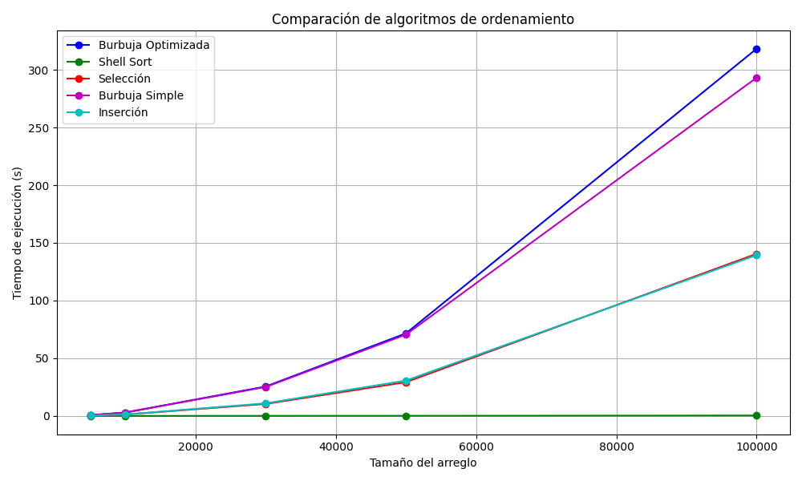

# Práctica de Algoritmos de Ordenamiento

## 📌 Información General

- **Título:** Práctica de Algoritmos de Ordenamiento  
- **Asignatura:** Estructura de Datos  
- **Carrera:** Computación  
- **Estudiante:** Axel Banegas, Pedro Panjón  
- **Fecha:** 11/05/2025
- **Profesor:** Ing. Pablo Torres  

---

## 🛠️ Descripción

Este proyecto consiste en la implementación y evaluación del desempeño de distintos algoritmos de ordenamiento en Python, incluyendo:  
- Método Burbuja  
- Método Burbuja Optimizado  
- Método Selección  
- Método Inserción  
- Método Shell Sort  

La evaluación se centra en medir el **tiempo de ejecución** para cada algoritmo con diferentes tamaños de entrada, asegurando condiciones justas mediante el uso del mismo arreglo base (clonado) para cada ejecución.

---
## 🚀 Ejecución

La aplicación realiza pruebas de rendimiento sobre cinco algoritmos de ordenamiento clásicos utilizando arreglos generados aleatoriamente. Para asegurar la imparcialidad en la medición, cada algoritmo opera sobre una copia exacta del mismo arreglo base, evitando que uno reciba datos ya ordenados. Los tamaños evaluados fueron: 5.000, 10.000, 30.000, 50.000 y 100.000 elementos.

Durante la ejecución, se imprime en consola el tiempo requerido por cada algoritmo para ordenar los arreglos de cada tamaño. Este tiempo se mide en segundos y refleja únicamente el proceso de ordenamiento, sin incluir visualizaciones ni pasos intermedios.

La salida es precisa, clara y sigue un formato uniforme, facilitando la recolección de datos para análisis comparativos y graficación posterior.

Ejemplo de salida:
```plaintext
Tamaño: 5000, Algoritmo: Burbuja Simple, Tiempo: 2.216555 segundos
Tamaño: 5000, Algoritmo: Selección, Tiempo: 0.759287 segundos
...
...
...

```

## 🕒 Tiempos de Ejecución por Método y Tamaño


| Tamaño   | Burbuja Simple | Burbuja Optimizada | Selección     | Inserción      | Shell Sort     |
|----------|----------------|--------------------|---------------|----------------|----------------|
| 5,000    | 2.216555 s     | 2.122465 s         | 0.759287 s    | 0.895726 s     | 0.018137 s     |
| 10,000   | 7.725991 s     | 7.921821 s         | 2.806287 s    | 2.816667 s     | 0.038624 s     |
| 30,000   | 68.269767 s    | 70.740288 s        | 26.433282 s   | 26.674269 s    | 0.136989 s     |
| 50,000   | 206.010405 s   | 246.271045 s       | 83.132089 s   | 85.309423 s    | 0.304209 s     |
| 100,000  | 889.694740 s   | 891.856014 s       | 364.297564 s  | 369.753983 s   | 0.710328 s     |


---
## 📈 Gráfica Comparativa de Rendimiento

A continuación se presenta una gráfica de líneas que compara el tiempo de ejecución (en segundos) de cada algoritmo de ordenamiento evaluado, en función del tamaño del arreglo.

> Eje X: Tamaño del arreglo  
> Eje Y: Tiempo de ejecución (s)



---
## 📸 Evidencias de Resultados

A continuación se muestran las capturas de consola con los tiempos de ejecución obtenidos por cada método de ordenamiento, agrupados por el tamaño del arreglo evaluado.

### 🧪 Tamaño: 5,000 elementos

  
  

---

### 🧪 Tamaño: 10,000 elementos

  
  

---

### 🧪 Tamaño: 30,000 elementos

  
  

---

### 🧪 Tamaño: 50,000 elementos

  
  

---

### 🧪 Tamaño: 100,000 elementos

  
  

---
## ✅ Conclusiones

- Shell Sort demostró que es el algoritmo más eficiente en todos los tamaños de entrada, con tiempos de ejecución significativamente menores, a comparacion de los otros algoritmos, lo que valida su complejidad aproximada de \( O(n \log^2 n) \). Confirmando asi su superioridad frente a algoritmos con complejidad cuadrática como Burbuja o Selección.

- Por otra parte los algoritmos con complejidad \( O(n^2) \), como Burbuja y Burbuja mejorado, mostraron un crecimiento Significativo en el tiempo de ejecución conforme aumentó el tamaño del arreglo, volviéndose ineficientes para gestionar grandes volúmenes de datos. Esto resalta la importancia de elegir algoritmos adecuados dependiendo de la eficiencia computacional y el uso adecuado de recursos como CPU y RAM.